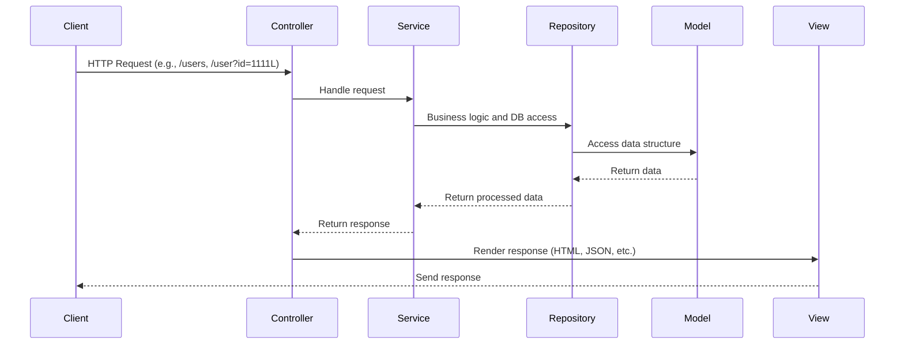

## 参考サイト

[参考サイト](https://qiita.com/smats-rd/items/ec2dc566bfb4b92f04d5)
[コードフォーマッタの準備](https://qiita.com/ryo8000/items/60714fa9c5ce261c1798)

## システム構成

### 構成

- ビルドツール：Maven
- 言語：JAVA

### API テストの方法

- curl コマンド
  - curl http://localhost:8080
  - curl -X POST http://localhost:8080/api/data -H "Content-Type: application/json" -d '{"name": "John"}
- Postman
- ブラウザ上で実行
